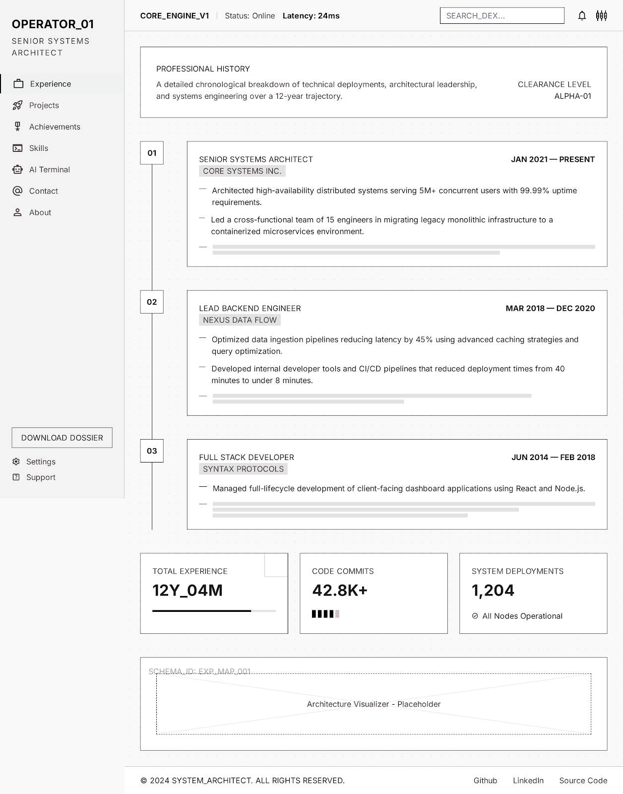
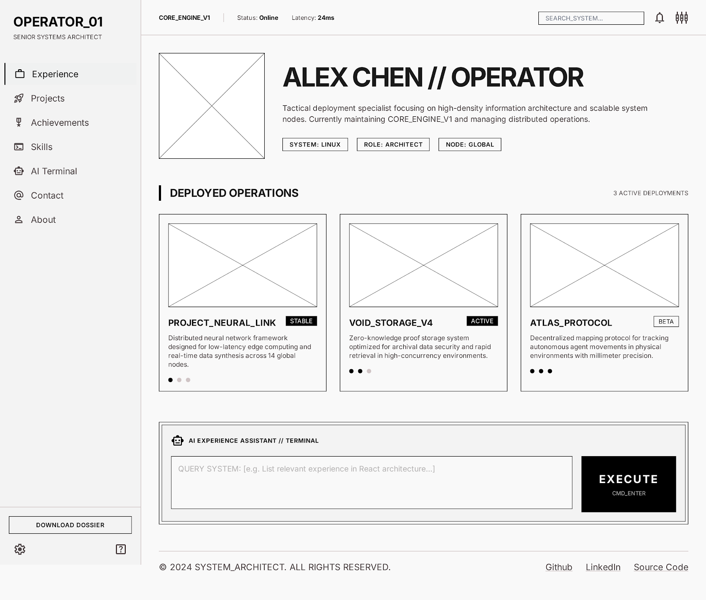
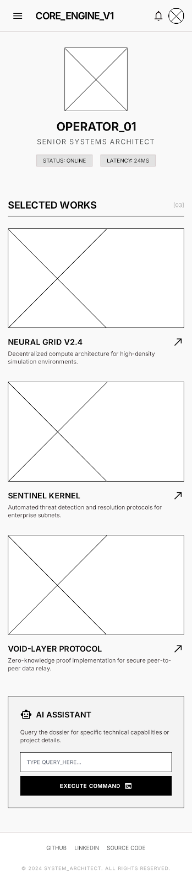

## Purpose and Audience

### Instructions: 

In 2–3 sentences, write a purpose statement for your site and write about your intended audience.

### Answer: 

The purpose of this project is to help me get a job by showing employers what I can do. It will show not just my resume, but will show projects I gave worked on. 

## Description of the Dynamic Elements
### Instructions:  

Describe how you will use Javascript to add dynamic elements to your site.

### Answer: 

There will be an array of various projects/achievements. The user can filter them based on various memes. I Also wa

## Pseudocode - Computational Thinking
###  Instructions: 

Write the out the logically steps of how you plan to code your application.

### Answer: 

(This is the final type idea)

#### homescreen elements:

#### Projects:

#### Achievements:

#### Skills:

#### AI terminal:

#### Contact:

#### About: 

(Here's what I'll be focusing on with this project)

#### Projects:

Uses flexbox to organize a list of the projects I have.
Each will be a model so that when you click on it, more info pops up
There will also be filters that filter certain projects (most reccent, using a certain programming language, how complex it is, etc.)

## Wireframe
###  Instructions: 

Create a wireframe for your project. Add your wireframe as an image or link to the site plan. If there are multiple pages, include one wireframe for each page.

### Answer: 

